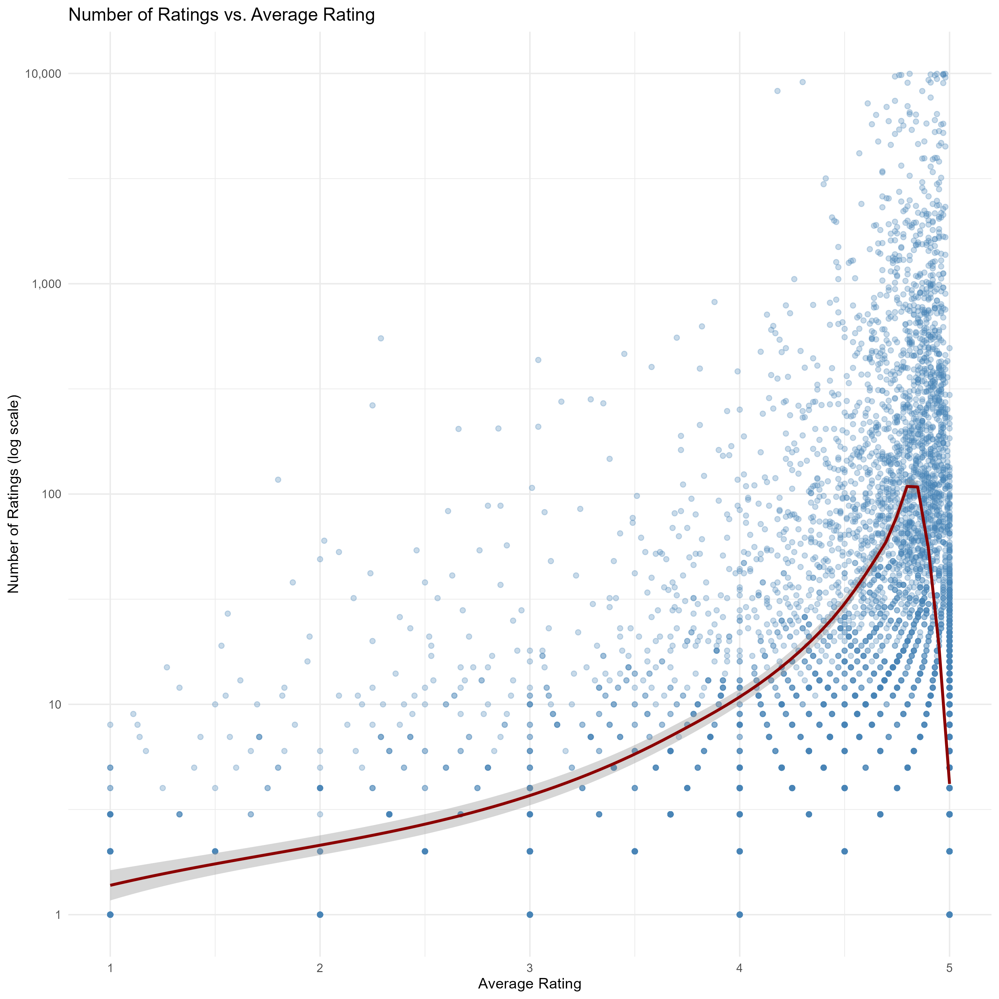
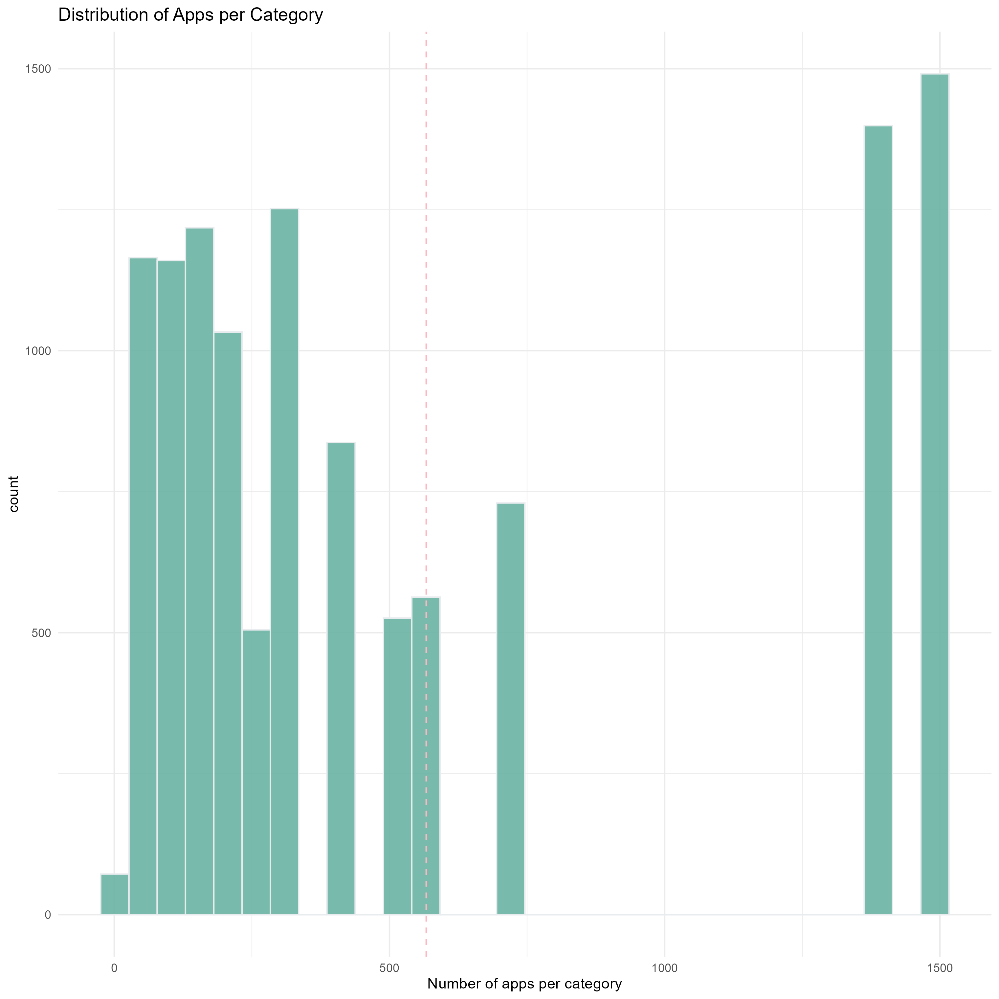
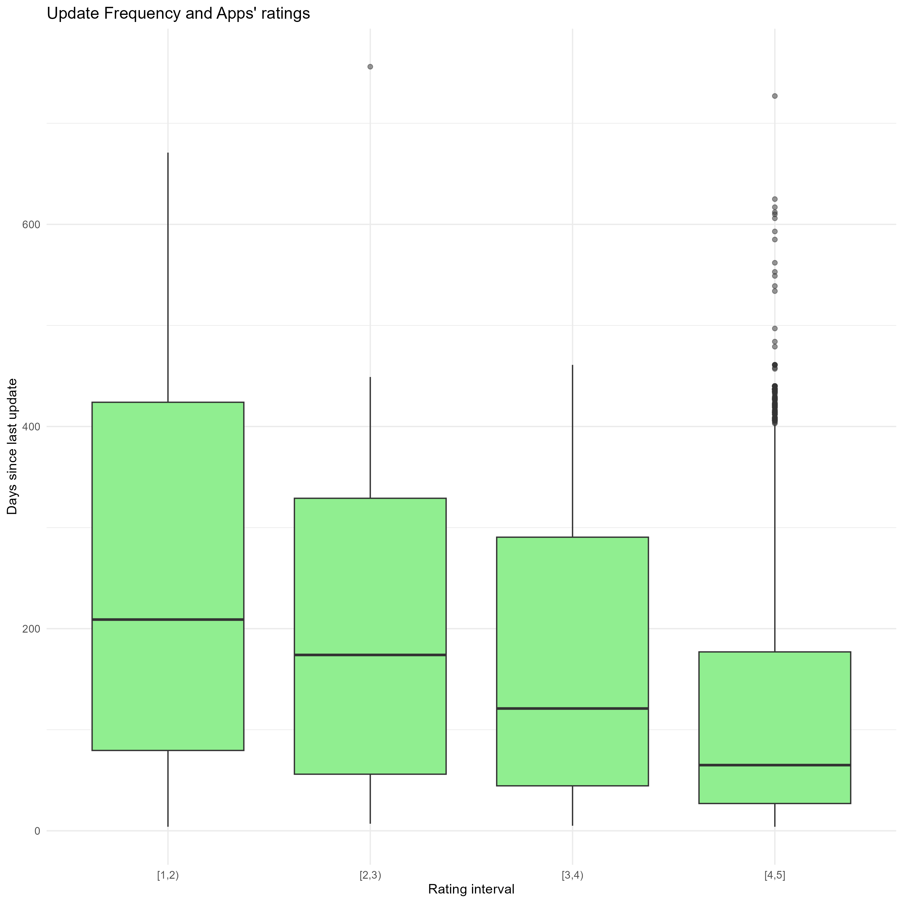
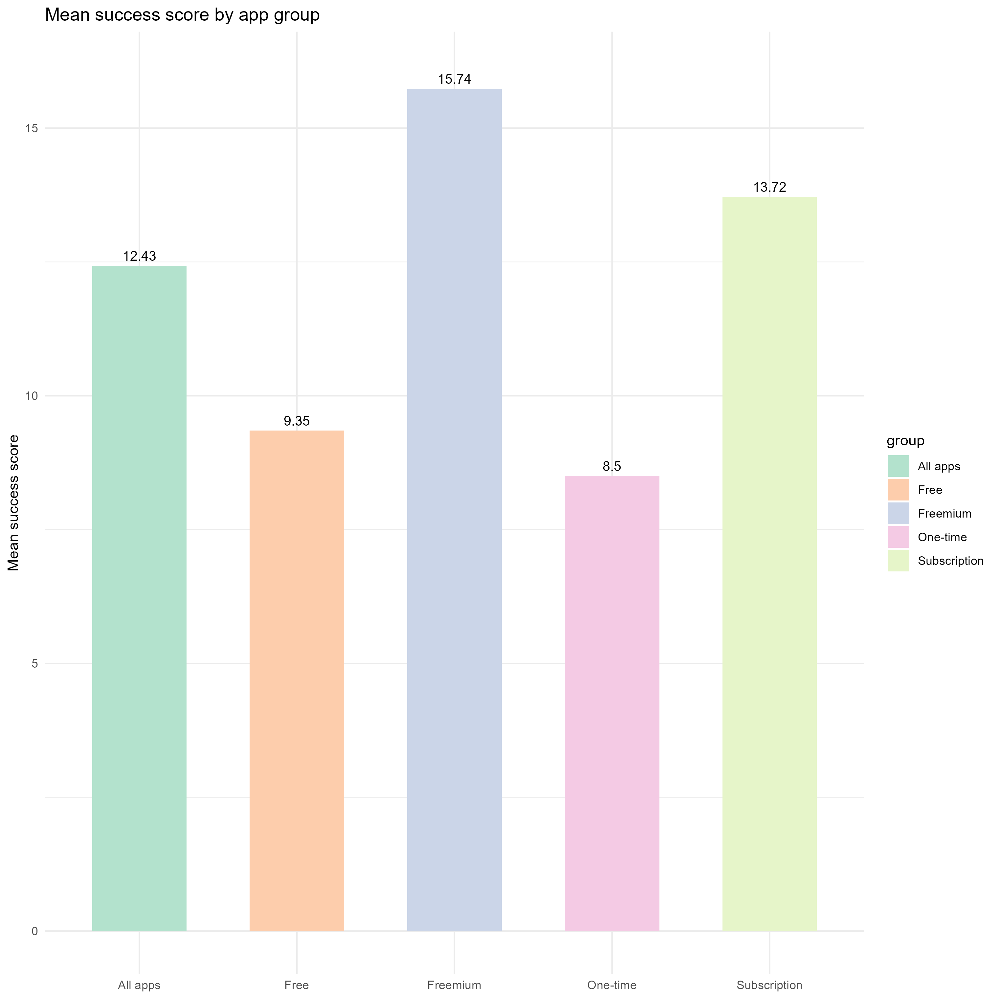
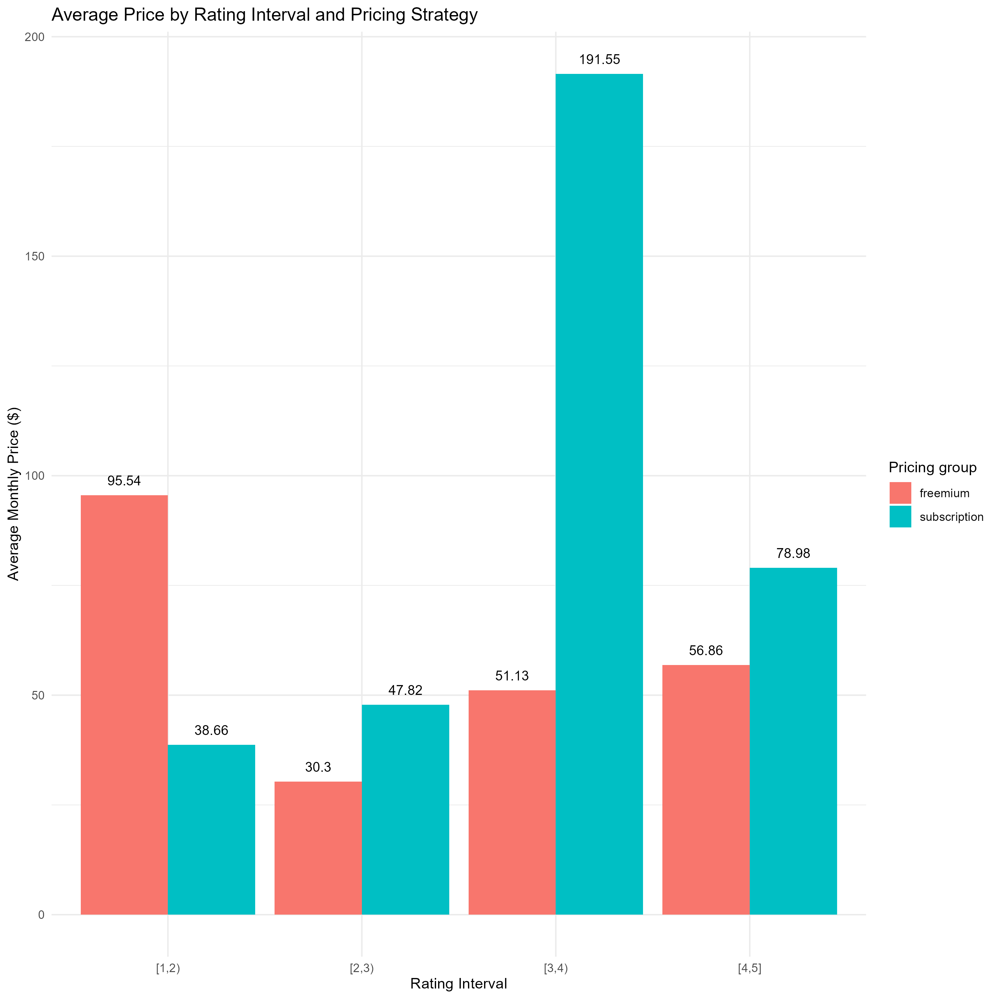
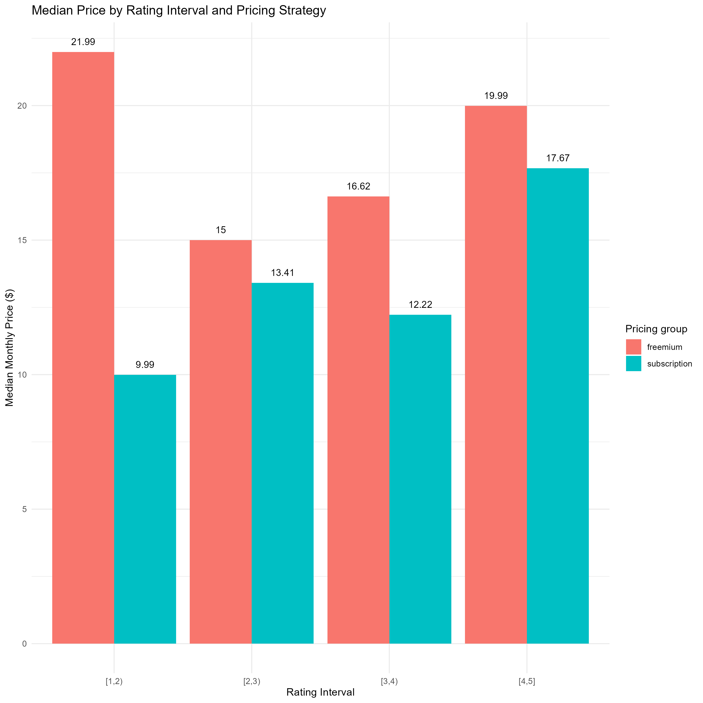
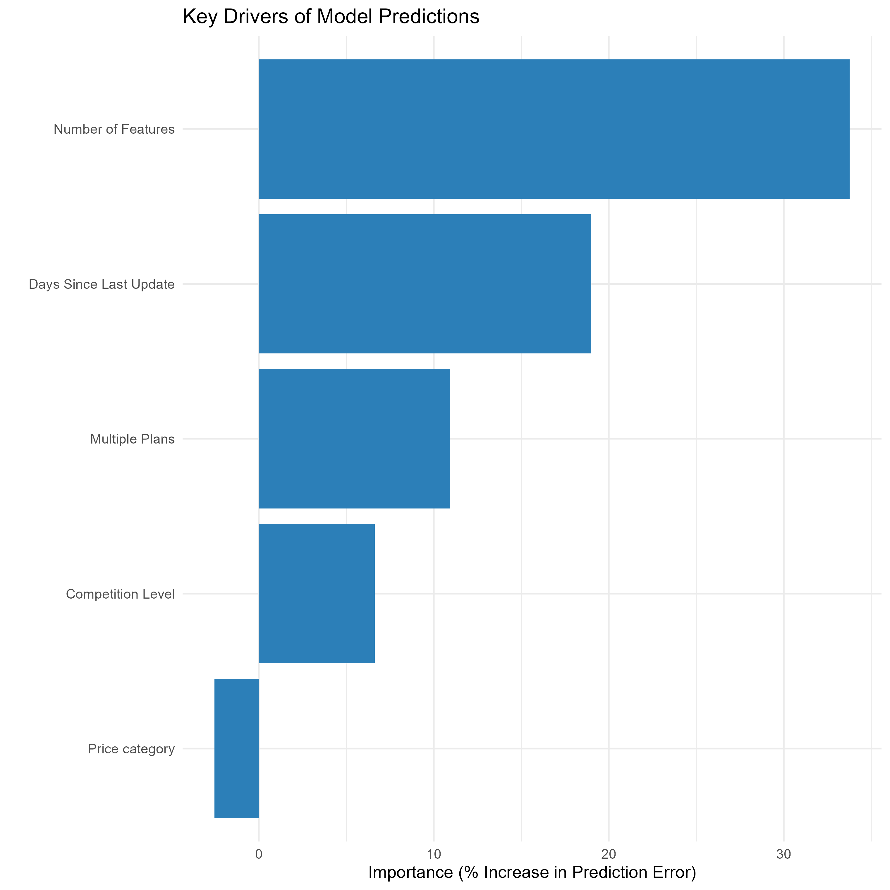

# What Factors Drive App Success in a Digital Marketplace?

## Index

- [About](#about)
- [Business Objective](#businessobjective)
- [Key Insights](#keyinsights)
- [Tools](#tools)
- [Project Structure](#projectstructure)
- [How to Reproduce](#howtoreproduce)
- [Report](#report)
- [Gallery](#gallery)
- [Credit/Acknowledgment](#creditacknowledgment)


## About
To analyze the success drivers in a digital SaaS marketplace, I use the Shopify App Store database, which contains web-scraped data on apps and reviews from the Shopify App Store. This project combines SQL-based feature engineering, statistical modelling in R, and NLP analysis in Python to derive actionable managerial insights on key economic factors. Understanding marketplace dynamics is crucial for SaaS developers and platform managers aiming to optimize pricing strategies and improve user engagement.

## Business Objective
**Identify key factors driving app success in the Shopify App Store.**

## Key Insights

The analysis led to the following results:

- Number of features and days since last update are the main drivers of apps' ratings
    + Feature richness significantly increase apps' success
    + An 8 month delay in software update leads to a **0.25** points decrease in ratings
- Pricing strategy plays a crucial role in determining app performance
    + Freemium apps' ratings is **1.39%** higher than the average and recieves **96** more reviews than paid-only apps.
    + Freemium apps have higher median prices than paid-only competitors
- Apps with more pricing tier show higher ratings and popularity levels
- Among subcription apps, price is not a determining factor of success

## Tools
- SQL (data cleaning & feature engineering)
- Python (NLP analysis)
- R (EDA & modeling)
- Quarto (reporting)

### R Prerequisites
This analysis was built using **R version 4.5.2** and relies on the following packages:

#### Data Wrangling & Workflow
 - `tidyverse`: Core suite for data manipulation
 - `readr`: Data reading
 - `ggplot2`: Custom graphs
 - `data.table`: High performance data manipulation
 - `janitor`: Tools for cleaning data
 - `here`: Robust file referecing
 - `skimr`: Summary statistics

#### Modelling & Machine learning
- `randomForest`: Random forest classification and regression
- `boot`: Bootstap functions for resampling
- `fixest`: Fixed-effects estimations
- `factorextra`: Extract and visualize results of multivariate analyses
- `tree`: Classification and regression tree
- `class`: Functions for classification
- `modelsummary`: Tables for regressions

#### Text Analysis
- `sentimentr`: Sentiment analysis
- `cld2`: Google's Compact Language Detector

#### Installation
You can install all the required packages at once by running the following command in your R console:

```r
install.packages(c(
  "tidyverse", "factoextra", "boot", "class", "tree", 
  "here", "janitor", "data.table", "skimr", "modelsummary", 
  "fixest", "randomForest", "cld2", "sentimentr", "readr", "stringr"
))
```

### Python Prerequisites
To perform the NLP analysis on categories, I used **Python (3.13+)**. The needed dependencies are:

#### Data & Enviroment
- `pandas`/`numpy`
- `pathlib`/`re`: Object-oriented filesystem paths

#### Natural Language Processing
- `bertopic`: Leveraging BERT embeddings
- `sentence-transformes`: Access cutting-edge models for text embeddings
- `sklearn.feature_extraction.text`: Term weighting

#### Dimensionality reduction & Clustering
- `umap-learn`: Uniform Manifold Approximization
- `hdbscan`: Hierarchical Density-Based Spatial Clusterting of Applications with Noise
- `sckit-learn`: Implementation of K-Means and data normalization

#### Installation
It is recommended to use a virtual environment. You can install the required libraries using:

```bash
pip install pandas numpy sentence-transformers scikit-learn hdbscan umap-learn bertopic
```


## Project Structure
The project has the following file structure

```
.
├── data/
│   ├── raw/
│   │   ├── apps
│   │   ├── apps_categories
│   │   ├── categories
│   │   ├── key_benefits
│   │   ├── pricing_plans_features
│   │   ├── pricing_plans
│   │   └── reviews
│   └── processed/
│       ├── apps_description
│       ├── apps_description_categories
│       ├── apps_description_prices_reviews
│       ├── clustered_categories
│       ├── clustered_categories2
│       ├── pricing_plans2
│       └── reviews_edited
│ 
├── output/
│ 
├── r_scripts/
│   ├── 1.eda.r
│   ├── 2.models.r
│   └── 3.sentiment_analysis.r
│ 
├── sql_queries/
│   ├── 1.schema_setup.sql
│   └── 2.joins.sql
│ 
├── text_clustering_py/
│   ├── text_clustering.py
│   └── optional_llm_naming.py
│ 
├── report.qmd
└── README.md
```


## How to reproduce
The original [Shopify App Store](https://www.kaggle.com/datasets/usernam3/shopify-app-store) dataset is sometimes updated so data downloaded may differ from the one used in this analysis (retrieved in March 2026). Data in the raw subfolders are untouched and allows replicability of results.

1. Run the `text_clustering.py` Python file to perform the NLP analysis and create the macro category variable.
2. Run in order `1.schema_setup.sql` and `2.joins.sql` from the SQL folder. At this step, you can also optionally run the second python file to give the names to an AI chatbot.
3. Run `1.eda.r` and `2.models.r`. File `3.sentiment_analysis.r` is a work in progress but can be runned at this stage
4. Render `report.qmd`


## Report

The final report can be find [here](https://andrea-m-giunta.github.io/app-success-analysis/report.html).

## Gallery

<table>
  <tr>
    <td></td>
    <td></td>
    <td></td>
    <td></td>
    <td></td>
    <td></td>
    <td></td>
  </tr>
</table>


## Credits/Acknowledgment
Thanks to Stanislav Dobrovolschii for letting the Shopify App Store dataset publically available.
